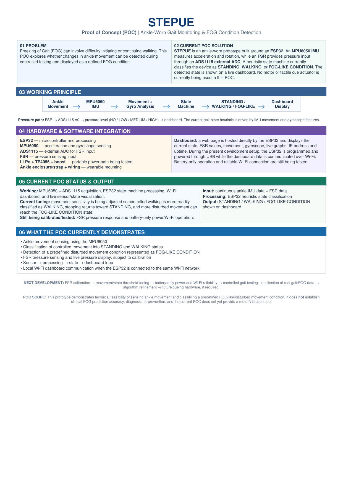
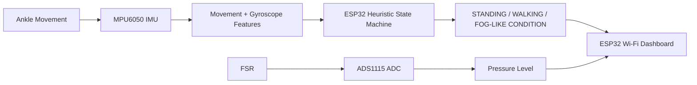

# STEPUE

### Ankle-Worn Gait Monitoring & FOG-Like Condition Detection — Proof of Concept

STEPUE is a wearable proof-of-concept built to investigate whether ankle movement and foot-pressure signals can be sensed in real time and used to classify controlled movement into **STANDING**, **WALKING**, and a predefined **FOG-LIKE CONDITION**.

> **POC ONLY:** This repository documents the **current STEPUE Proof of Concept** and the work completed so far. It is **not the final STEPUE product**. The final-product architecture, hardware, firmware, algorithms, enclosure, validation, and documentation are still under development and will be published separately when ready.
>
> **POC scope:** The current implementation is a technical prototype using heuristic state classification for controlled testing. It does **not** establish clinical FOG prediction accuracy, diagnosis, or prevention.



---

## Current POC at a glance

| Part | Current status |
|---|---|
| ESP32 | Working as the main controller |
| MPU6050 | Working for acceleration + gyroscope acquisition |
| ADS1115 | Working as external ADC for the FSR input |
| FSR | Connected and visualized; pressure thresholds still require calibration |
| State machine | Working: STANDING / WALKING / FOG-LIKE CONDITION |
| Wi-Fi dashboard | Working on the local network |
| Live sensor visualization | Working |
| Battery-only operation | Still being tested |
| Motor/vibration cue | **Not part of the current POC** |
| Clinical/ML validation | Not yet performed |

---

## How it works



### Sensor path

- **MPU6050:** acceleration and gyroscope data.
- **FSR → ADS1115 A0:** pressure measurement.
- **ESP32:** reads both sensor paths, calculates simple movement/rotation features, applies threshold-based logic, and serves the dashboard.
- **Dashboard:** displays state, FSR values, movement, gyroscope values, live graphs, IP address and uptime.

The current firmware uses a **100 ms delay** in the main loop, so the delay alone permits at most about 10 iterations/second; actual throughput is slightly lower because sensor reads and processing also consume time.

---

## Repository structure

```text
STEPUE-PoC/
├── README.md
├── .gitignore
├── LICENSE
├── firmware/
│   └── STEPUE_Updated_Color_Dashboard.ino
├── hardware/
│   ├── circuit-diagram.svg
│   ├── pinout.md
│   └── bom.md
├── images/
│   └── stepue-poc-overview.png
├── docs/
│   ├── architecture.md
│   ├── current-poc.md
│   ├── STEPUE_POC_Report.pdf
│   ├── STEPUE_Revised_PoC_Document.docx
│   └── historical-design-notes.md
└── data/
    └── README.md
```

---

## Hardware

### Core POC hardware

- ESP32 development board
- MPU6050 6-axis IMU
- ADS1115 16-bit 4-channel ADC
- FSR pressure sensor
- Li-Po + TP4056 + boost/regulation path under testing
- Ankle mounting/strap and wiring

The broader STEPUE hardware concept also explored multiple FSRs and vibrotactile actuators, but those should not be represented as completed functionality in the current POC.

See:

- [`hardware/pinout.md`](hardware/pinout.md)
- [`hardware/bom.md`](hardware/bom.md)
- [`hardware/circuit-diagram.svg`](hardware/circuit-diagram.svg)

---

## Main I²C connections

| Device | Pin | ESP32 |
|---|---|---|
| MPU6050 | SDA | GPIO 21 |
| MPU6050 | SCL | GPIO 22 |
| MPU6050 | VCC | 3.3 V |
| MPU6050 | GND | GND |
| ADS1115 | SDA | GPIO 21 |
| ADS1115 | SCL | GPIO 22 |
| ADS1115 | VCC | 3.3 V |
| ADS1115 | GND | GND |
| FSR | Signal | ADS1115 A0 |

The firmware currently uses MPU6050 address `0x68` and ADS1115 address `0x49`.

---

## Firmware

The main firmware is:

[`firmware/STEPUE_Updated_Color_Dashboard.ino`](firmware/STEPUE_Updated_Color_Dashboard.ino)

The code currently contains:

- ESP32 Wi-Fi connection
- Embedded HTTP server
- MPU6050 acquisition
- ADS1115 acquisition
- FSR voltage/pressure-level estimation
- Movement magnitude calculation
- Gyroscope magnitude calculation
- Heuristic state machine
- JSON telemetry endpoint
- Browser-based live dashboard

### Important

Wi-Fi credentials in the repository have been replaced with placeholders. Before flashing the board, set:

```cpp
const char* WIFI_SSID = "YOUR_WIFI_SSID";
const char* WIFI_PASSWORD = "YOUR_WIFI_PASSWORD";
```

Do **not** commit real Wi-Fi passwords or API keys.

---

## Current heuristic logic

The firmware derives simple quantities from the MPU6050:

```text
acceleration magnitude = sqrt(ax² + ay² + az²)
gyroscope magnitude   = sqrt(gx² + gy² + gz²)
movement              = |acceleration magnitude - 1.0|
```

The current prototype uses threshold rules to identify:

- relatively still movement → **STANDING**
- ordinary movement → **WALKING**
- high/irregular movement or axis disturbance → **FOG-LIKE CONDITION**

These are **prototype heuristics**, not a clinically validated FOG detector.

---

## Dashboard

The ESP32 hosts the dashboard locally over Wi-Fi. The dashboard can expose:

- Current state
- Accelerometer axes
- Movement magnitude
- Gyroscope magnitude
- FSR raw ADC value
- FSR voltage
- Pressure level
- ESP32 IP address
- Uptime
- Live graphs/telemetry

The dashboard does not require an internet connection once the ESP32 and viewing device are on the same local network.

---

## What has actually been demonstrated

1. Real-time ankle movement sensing using the MPU6050.
2. Real-time FSR acquisition through the ADS1115.
3. ESP32-side state processing.
4. Controlled STANDING/WALKING classification.
5. A predefined disturbed-movement condition represented as FOG-LIKE CONDITION.
6. Local Wi-Fi communication.
7. A live browser dashboard for sensor/state visualization.

### Not yet demonstrated

- Clinical FOG prediction accuracy.
- Generalization across Parkinson's patients.
- A trained machine-learning model.
- A clinically validated pre-FOG predictor.
- Reliable battery-only boot and Wi-Fi operation.
- Fully calibrated pressure-to-force/weight mapping.
- Final haptic actuator integration in this current POC.

---

## Development roadmap

> **Repository status:** This roadmap describes future development only. The final product is intentionally **not included in this repository yet**. The POC BOM is final for this POC iteration, but hardware/components may change during final-product development.

```text
Current POC
   ↓
FSR calibration
   ↓
Movement/state threshold tuning
   ↓
Battery-only + Wi-Fi reliability
   ↓
Controlled gait testing
   ↓
Collection of real gait / FOG data
   ↓
Algorithm refinement
   ↓
Future cueing hardware
   ↓
Controlled validation
   ↓
Clinical validation
```

---

## Documentation

- [`docs/current-poc.md`](docs/current-poc.md) — exact current POC status.
- [`docs/architecture.md`](docs/architecture.md) — system/data architecture.
- [`hardware/pinout.md`](hardware/pinout.md) — wiring reference.
- [`hardware/bom.md`](hardware/bom.md) — final POC BOM summary.
- [`hardware/STEPUE_POC_Final_BOM.xlsx`](hardware/STEPUE_POC_Final_BOM.xlsx) — user-supplied final POC procurement sheet.
- [`docs/historical-design-notes.md`](docs/historical-design-notes.md) — earlier design ideas kept separate from current implementation.
- [`docs/STEPUE_POC_Report.pdf`](docs/STEPUE_POC_Report.pdf) — POC summary document.
- [`docs/STEPUE_Revised_PoC_Document.docx`](docs/STEPUE_Revised_PoC_Document.docx) — earlier technical/research documentation.

---

## BOM status

The repository includes the **final POC-only BOM supplied for this iteration**. It is not being
treated as the final product/manufacturing BOM; later revisions may change the component
selection or quantities. The spreadsheet in `hardware/STEPUE_POC_Final_BOM.xlsx` is preserved
as the supplied procurement sheet, while `hardware/bom.md` provides a GitHub-readable copy.

## Disclaimer

STEPUE is a student/research proof-of-concept for technical experimentation. It should not be used as a medical device, diagnostic system, or treatment without appropriate validation, safety review, and regulatory/clinical processes.

---

## License

MIT License. See [`LICENSE`](LICENSE).
