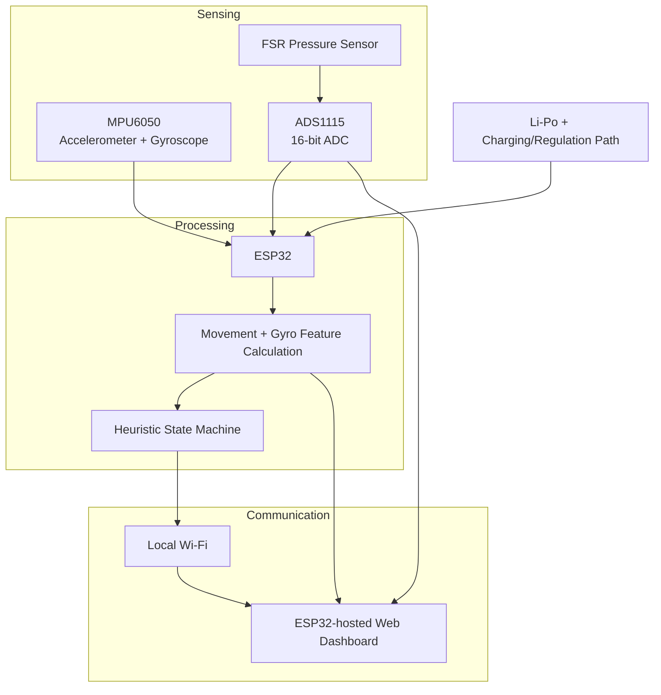

# STEPUE — Architecture

## High-level architecture



## I²C bus

The MPU6050 and ADS1115 share the ESP32 I²C bus:

```text
ESP32 GPIO21 SDA ──┬── MPU6050 SDA
                   └── ADS1115 SDA

ESP32 GPIO22 SCL ──┬── MPU6050 SCL
                   └── ADS1115 SCL
```

## Data path

```text
Raw IMU data
    ↓
Acceleration magnitude + gyro magnitude
    ↓
Movement / disturbance heuristics
    ↓
State machine
    ↓
STANDING / WALKING / FOG-LIKE CONDITION
```

In parallel:

```text
FSR
 ↓
ADS1115 A0
 ↓
Raw ADC + voltage
 ↓
NO / LOW / MEDIUM / HIGH PRESSURE
 ↓
Dashboard
```
